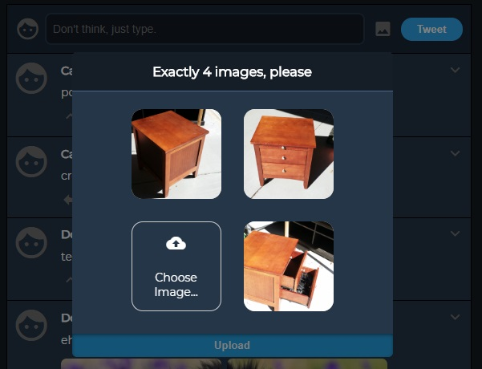

## Twit
A Twitter clone where you can only tweet 4 words at a time. Nowhere near complete, but most of the basic functionality is implemented.

### Tech stack
* Node.js + Express
* React, Redux, React Router
* SCSS
* MongoDB
* WebPack + Babel

### Current Features
* Dashboard page showing Tweets by followed users, ordered chronologically

  

* Tweets and reply threads

  

* Image upload with server-side deduplication

  

* User profile pages

  

* Security: hashed + salted passwords, authorization-protected APIs
